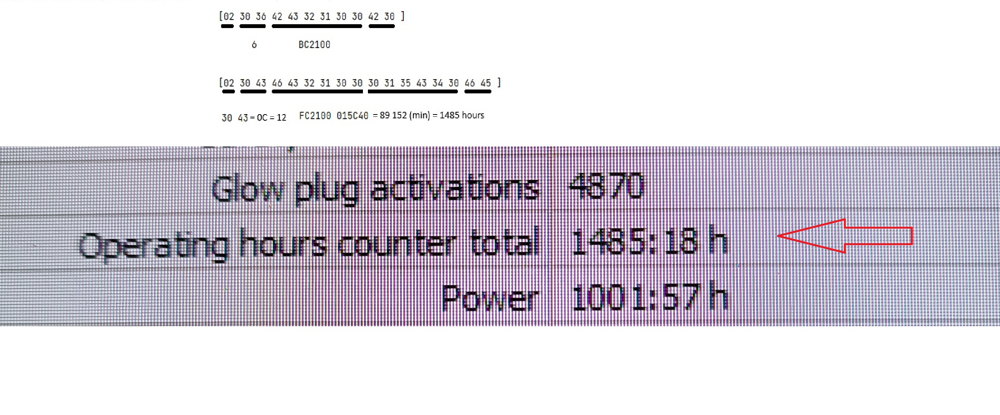

# arduino_eberspacher_d3_controller

Hi. I have vw t5 with installed eberspacher D3 plus heater in it.
Of course, it has a controller for the heater on the roof. But I don't find it very convenient. 
I would like to make a controller myself using an Arduino. 

I already have some success, some progress.
Unfortunately, the photos are not very high quality, but I took them only for analyzing (parsing) the protocol.

I found the appropriate contact in the connector under the passenger seat. I soldered an adapter for the K-line diagnostics and started controlling the heater using the Edith software.
At the same time, I was recording the data stream between the heater and the software.

Edith works with two (interesting for us) modes -- 
 * read common info mode
 * test work mode 
 (I don't remember how exactly menu items called) 
 
 

Edith app is master, heater is slave.

Message consists of 5 parts: [02][message lenght 2 bytes][command][data (optional) ][src 2 bytes] 

02 30 34 31 30 30 45 33 43
02 30 32 35 30 43 39 

02 30 32 33 45 44 43

